# CameraFilter

Realtime camera filters. Process frames by OpenGL shaders.

**[Download the apk](https://github.com/nekocode/CameraFilter/releases)** to have a try.

## Filters

Thanks to the original authors of the shader codes. I had only portted them from webgl to opengl es.

| Filter | Preview | Filter | Preview |
| :----- | :------ | :----- | :------ |
| [Edge Detection](https://www.shadertoy.com/view/Xtd3W7) | 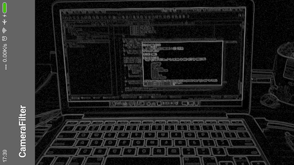 | [Pixelize](https://www.shadertoy.com/view/4lXXDH) | 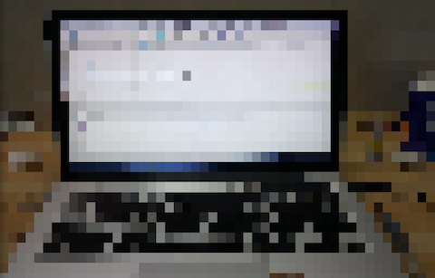|
| [EM Interference](https://www.shadertoy.com/view/lsXSWl) | 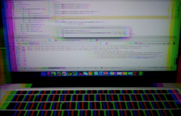| [Triangles Mosaic](https://www.shadertoy.com/view/4d2SWy) | 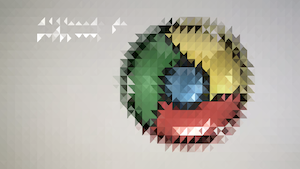 |
| [Legofied](https://www.shadertoy.com/view/XtBSzy) | 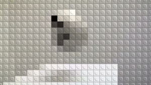 | [Tile Mosaic](https://www.shadertoy.com/view/MtfXRN) | 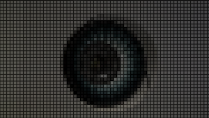 |
| [Blueorange](https://www.shadertoy.com/view/MslGzr) | 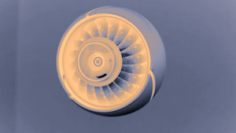 | [Chromatic Aberration](https://www.shadertoy.com/view/Mds3zn) | 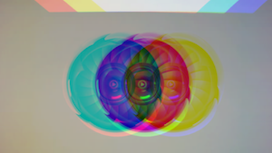 |
| [Basic Deform](https://www.shadertoy.com/view/XdsGzH) | 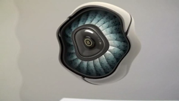 | [Contrast](https://www.shadertoy.com/view/Xdf3RN) | 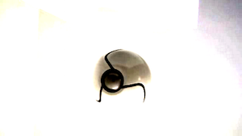 |
| [NoiseWarp](https://www.shadertoy.com/view/4sX3RN) | 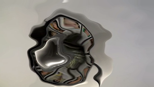 | [Refraction](https://www.shadertoy.com/view/MsX3zN) | 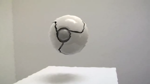 |
| [Mapping](https://www.shadertoy.com/view/XsX3R7) | 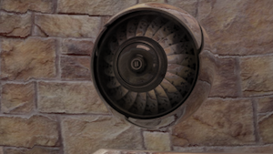 | [Crosshatch](https://www.shadertoy.com/view/MdX3Dr) | 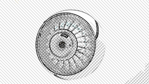 |
| [Lichtenstein-esque](https://www.shadertoy.com/view/Mdf3zS) | 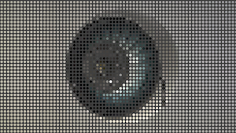 | [Ascii Art](https://www.shadertoy.com/view/lssGDj) | 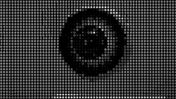 |
| [Money Filter](https://www.shadertoy.com/view/XlsXDN) | 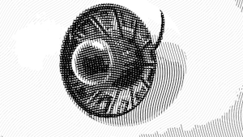 | [Cracked](https://www.shadertoy.com/view/XdBSzW) | 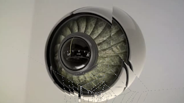 |
| [Polygonization](https://www.shadertoy.com/view/4lsXR7) | 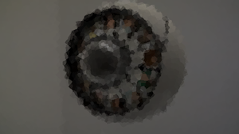 | [JFA Voronoi](https://www.shadertoy.com/view/4sy3W3) | 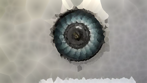 |
